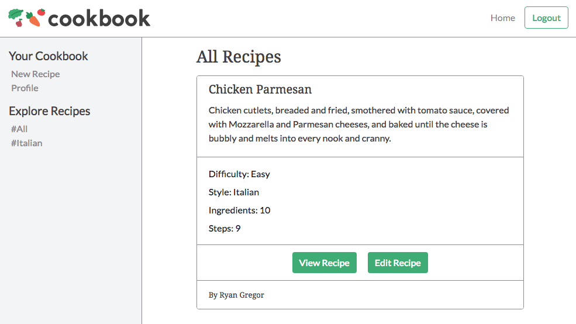
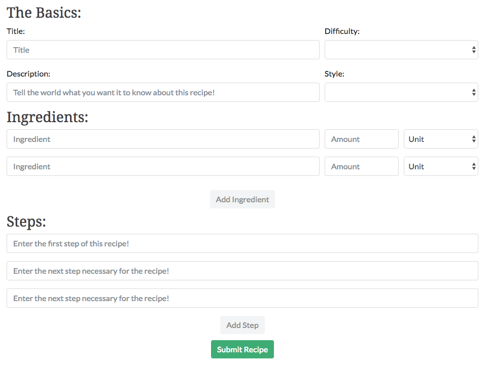

# Item Catalog Project

This is my submission for the fourth project in the Udacity Full Stack Nanodegree. It is a simple Flask application that uses a sqlite3 database to store recipes entered by users.
  
  
  
  
# Instructions to Run
## You will need:

  1. VirtualBox
  
     [Download here](https://www.virtualbox.org/wiki/Downloads)
     
  2. Vagrant
  
     [Download here](https://www.vagrantup.com/downloads.html)
     
  3. VM Configuration File
  
     [Download by forking and cloning this repository](https://github.com/udacity/fullstack-nanodegree-vm)
     
  4. From terminal, `cd` into the Vagrant directory
  5. Use command `vagrant up` to start your virtual machine
  6. Once `vagrant up` is complete, use `vagrant ssh` to log into your virtual machine
  7. Download and clone this repository and add it to your vagrant directory
  8. From your virtual machine while in the vagrant directory, use command `python cookbook.py` to run the file
